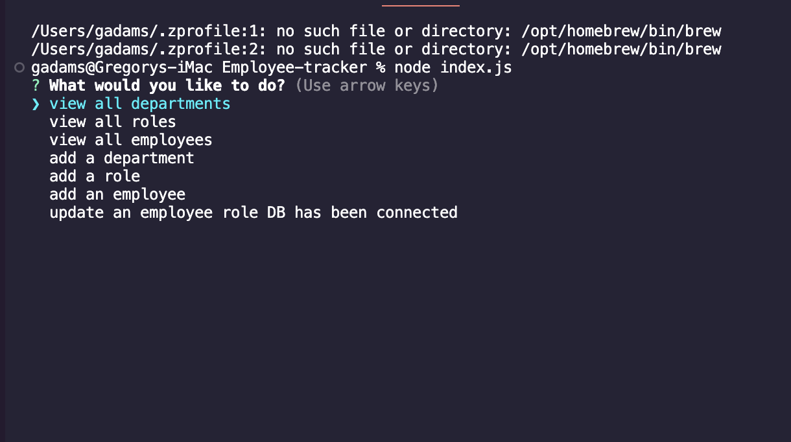

# Employee Tracker

## Description

I created a database to for a software company to be able to track departments, employees throughout their company This will come in handy for any company who wants the freedom to update and change throughout their company.  I learned a lot about MySQL.  It was fun and challenging.

## Installation

This is a terminal based app.  Type "node index.js" to start app.

## Usage
 
    

## Credits

Credit to the company who let me utitlize their data to build this and ED-X.

## How to Contribute

This was built by Greg Adams

## Questions
- Github username: gadams45
- Email address: gadams8340@gmail.com